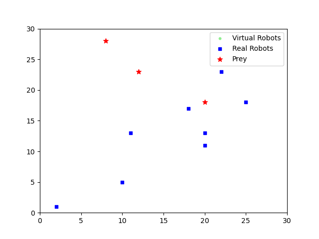
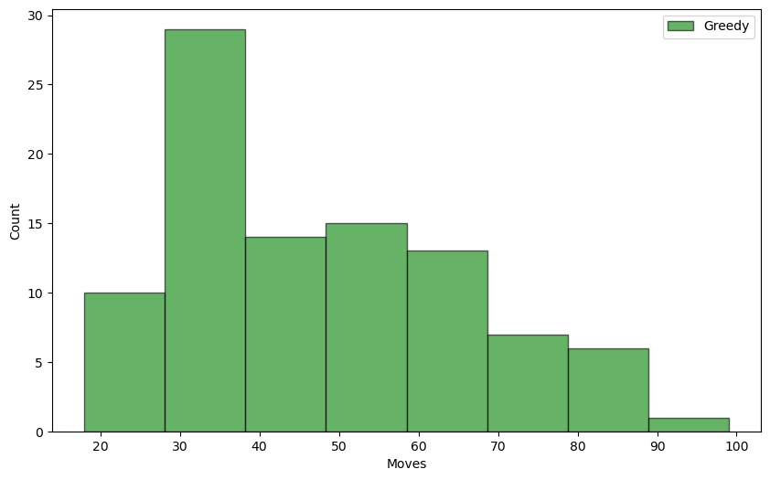

# BSOPredator

## Project Structure

```
BSOPredator
├─gridTest.ipynb
├─README.md
├─images
│  └─README
├─optim
│  ├─greedy
│  ├─BSO
│  └─PSO
├─output
│  └─example.gif
├─prey
│  ├─prey.py
│  └─utils.py
└─visual
    └─visual.py
```

## Example Result



## Prey Logic

Add prey logic in `prey/prey.py`, helper funtions are defined in `prey/utils.py`.

## Predator Logic

Add predator logic in `optim` directory. It is suggested to create a folder for each logic. Currently `optim/greedy/greedy.py` supports multiple preys.

## Test & Analysis

Test predator algorithm in `gridTest.ipynb`. Substitute `prey_logic` and `predator_logic` with tested ones. Moves needed to capture all the preys are recorded and shown in the distribution graph.



